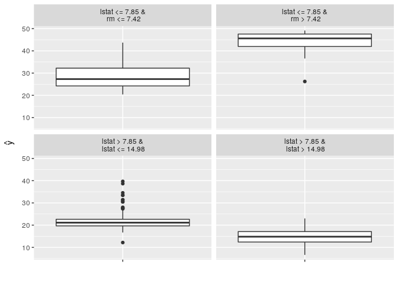

[](https://travis-ci.org/christophM/iml)

iml: interpretable machine learning
===================================

`iml` is an R package that interprets the behaviour and explains predictions of machine learning models. It implements model-agnostic interpretability methods - meaning they can be used with any machine learning model.

Currently implemented:

-   Feature importance
-   Partial dependence plots
-   Individual conditional expectation plots (ICE)
-   Tree surrogate
-   LIME: Local Interpretable Model-agnostic Explanations
-   Shapley value for explaining single predictions

Read more about the methods in the [Interpretable Machine Learning book](https://christophm.github.io/interpretable-ml-book/agnostic.html)

Installation
============

The package can be installed directly from github with devtools:

``` r
# install.packages("devtools")
devtools::install_github('christophM/iml')
```

Examples
========

First we train a randomForest to predict the Boston median housing value

``` r
library('iml')

library('randomForest')
data("Boston", package  = "MASS")
mod = randomForest(medv ~ ., data = Boston, ntree = 50)
```

#### What were the most important features? (Permutation feature importance / Model reliance)

``` r
imp = feature.imp(mod, Boston, y = Boston$medv, loss = 'mae')
plot(imp)
```


``` r
imp$data()
```

    ## # A tibble: 14 x 3
    ##    ..feature error importance
    ##    <fct>     <dbl>      <dbl>
    ##  1 age       1.39        1.39
    ##  2 black     1.27        1.27
    ##  3 chas      1.01        1.02
    ##  4 crim      1.65        1.65
    ##  5 dis       1.75        1.75
    ##  6 indus     1.75        1.76
    ##  7 lstat     4.68        4.69
    ##  8 medv      0.997       1.00
    ##  9 nox       1.75        1.75
    ## 10 ptratio   1.42        1.43
    ## 11 rad       1.08        1.08
    ## 12 rm        3.39        3.40
    ## 13 tax       1.33        1.33
    ## 14 zn        1.02        1.02

### Let's build a single tree from the randomForest predictions! (Tree surrogate)

``` r
tree = tree.surrogate(mod, Boston[which(names(Boston) != 'medv')], maxdepth = 2)
plot(tree)
```



### How does lstat influence the prediction on average? (Partial dependence plot)

``` r
pdp.obj = pdp(mod, Boston, feature = 13)
plot(pdp.obj)
```


### How does lstat influence the individual predictions? (ICE)

``` r
ice.curves = ice(mod, Boston[1:100,], feature = 13)
plot(ice.curves) 
```


### Explain a single prediction a local linear model. (LIME)

``` r
x = Boston[1,]
lime.explain = lime(mod, Boston, x.interest = x)
lime.explain$data()
```

    ##              beta x.scaled     effect x.original feature feature.value
    ## rm     0.50908514    6.575  3.3472348      6.575      rm      rm=6.575
    ## lstat -0.05140837    4.980 -0.2560137       4.98   lstat    lstat=4.98
    ## medv   0.71921815   24.000 17.2612357         24    medv       medv=24

``` r
plot(lime.explain)
```


### Explain a single prediction with game theory. (Shapley)

``` r
x = Boston[1,]
shapley.explain = shapley(mod, Boston, x.interest = x)
shapley.explain$data()
```

    ## # A tibble: 14 x 3
    ## # Groups:   feature [?]
    ##    feature     phi phi.var
    ##    <fct>     <dbl>   <dbl>
    ##  1 age     -0.113   0.495 
    ##  2 black   -0.0753  0.216 
    ##  3 chas    -0.0201  0.0136
    ##  4 crim    -0.0839  1.43  
    ##  5 dis     -0.391   1.27  
    ##  6 indus    0.818   1.47  
    ##  7 lstat    3.78   15.8   
    ##  8 medv     0       0     
    ##  9 nox     -0.183   1.88  
    ## 10 ptratio  0.485   0.322 
    ## 11 rad     -0.250   0.121 
    ## 12 rm      -0.985  11.5   
    ## 13 tax     -0.0407  0.399 
    ## 14 zn       0.0465  0.0115

``` r
plot(shapley.explain)
```


