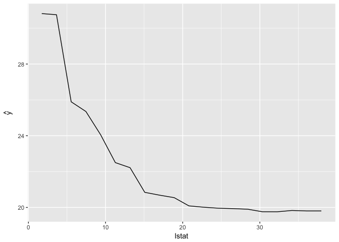

[](https://travis-ci.org/christophM/iml)

iml: interpretable machine learning
===================================

`iml` is an R package that interprets the behaviour and explains predictions of machine learning models. It implements model-agnostic interpretability methods - meaning they can be used with any machine learning model.

Currently implemented:

-   Feature importance
-   Partial dependence plots
-   Individual conditional expectation plots (ICE)
-   Tree surrogate
-   LIME: Local Interpretable Model-agnostic Explanations
-   Shapley value for explaining single predictions

Read more about the methods in the [Interpretable Machine Learning book](https://christophm.github.io/interpretable-ml-book/agnostic.html)

Installation
============

The package can be installed directly from github with devtools:

``` r
# install.packages("devtools")
devtools::install_github("christophM/iml")
```

Examples
========

First we train a randomForest to predict the Boston median housing value

``` r
library("iml")

library("randomForest")
data("Boston", package  = "MASS")
rf = randomForest(medv ~ ., data = Boston, ntree = 50)
model = Predictor$new(rf)
```

#### What were the most important features? (Permutation feature importance / Model reliance)

``` r
imp = FeatureImp$new(model, Boston[which(names(Boston) != "medv")], y = Boston$medv, loss = "mae")
plot(imp)
```


``` r
imp$results
```

    ## # A tibble: 13 x 4
    ##    feature original.error permutationError importance
    ##    <fct>            <dbl>            <dbl>      <dbl>
    ##  1 lstat             1.00             4.24       4.22
    ##  2 rm                1.00             3.27       3.26
    ##  3 crim              1.00             1.73       1.72
    ##  4 ptratio           1.00             1.73       1.72
    ##  5 nox               1.00             1.66       1.65
    ##  6 dis               1.00             1.65       1.65
    ##  7 indus             1.00             1.61       1.60
    ##  8 age               1.00             1.38       1.37
    ##  9 tax               1.00             1.36       1.35
    ## 10 black             1.00             1.25       1.24
    ## 11 rad               1.00             1.16       1.16
    ## 12 zn                1.00             1.06       1.06
    ## 13 chas              1.00             1.03       1.03

### Let"s build a single tree from the randomForest predictions! (Tree surrogate)

``` r
tree = TreeSurrogate$new(model, Boston[which(names(Boston) != "medv")], maxdepth = 2)
plot(tree)
```


### How does lstat influence the prediction on average? (Partial dependence plot)

``` r
pdp.obj = PartialDependence$new(model, Boston, feature = "lstat")
plot(pdp.obj)
```



### How does lstat influence the individual predictions? (ICE)

``` r
ice.curves = Ice$new(model, Boston[1:100,], feature = "lstat")
plot(ice.curves) 
```


### Explain a single prediction with a local linear model. (LIME)

``` r
lime.explain = Lime$new(model, Boston, x.interest = Boston[1,])
lime.explain$results
```

    ##              beta x.recoded     effect x.original feature feature.value
    ## rm     0.37823223     6.575  2.4868769      6.575      rm      rm=6.575
    ## lstat -0.04662682     4.980 -0.2322016       4.98   lstat    lstat=4.98
    ## medv   0.79049115    24.000 18.9717876         24    medv       medv=24

``` r
plot(lime.explain)
```


### Explain a single prediction with game theory. (Shapley)

``` r
shapley.explain = Shapley$new(model, Boston, x.interest = Boston[1, ])
shapley.explain$results
```

    ## # A tibble: 14 x 4
    ## # Groups:   feature [?]
    ##    feature     phi phi.var featureValue
    ##    <fct>     <dbl>   <dbl> <chr>       
    ##  1 age     -0.0504  0.396  crim=0.00632
    ##  2 black    0.0291  0.266  zn=18       
    ##  3 chas    -0.0201  0.0127 indus=2.31  
    ##  4 crim    -0.198   1.35   chas=0      
    ##  5 dis     -0.161   1.61   nox=0.538   
    ##  6 indus    0.648   1.81   rm=6.575    
    ##  7 lstat    3.80   21.1    age=65.2    
    ##  8 medv     0       0      dis=4.09    
    ##  9 nox      0.0631  1.39   rad=1       
    ## 10 ptratio  0.813   1.10   tax=296     
    ## 11 rad     -0.461   0.453  ptratio=15.3
    ## 12 rm       0.117   8.07   black=396.9 
    ## 13 tax     -0.147   0.514  lstat=4.98  
    ## 14 zn      -0.102   0.0470 medv=24

``` r
plot(shapley.explain)
```


Python Implementation
=====================

Referring to <https://github.com/datascienceinc/Skater>
